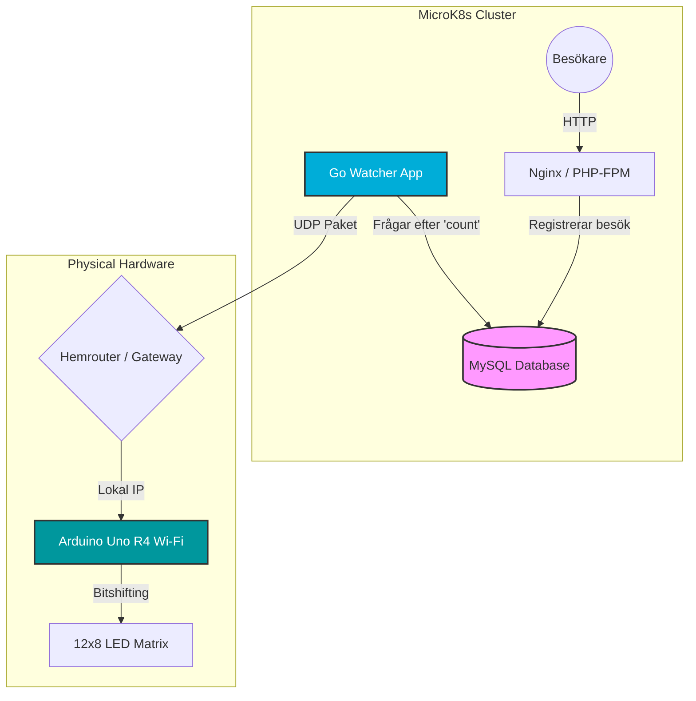

# arduino-go-networking-project
How to communicate between Go-lang, php, and arduino R4 uno Wi-Fi, over kubernetes / docker containers and with an UDP connection between Go-lang and the arduino.
Initial flowchart of this project.

